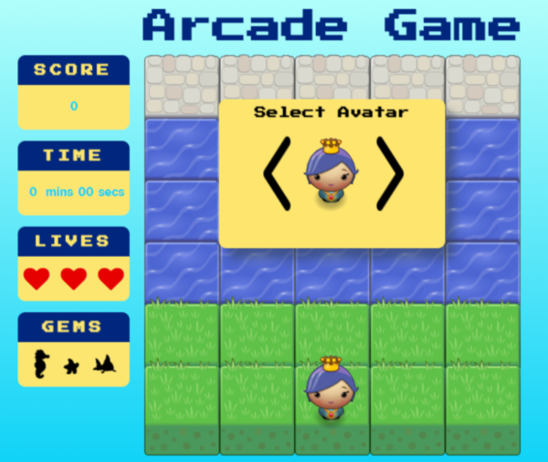

frontend-nanodegree-arcade-game
===============================

# Arcade Game Project

## Table of Contents

* [General](#general)
* [How to play](#how-to-play)
* [Instructions](#instructions)
* [Special features](#special-features)
* [Resources](#resources)

## General:

This game was built as a Udacity Course project. The Arcade Game Project is all about demonstrating object programming in JavaScript.

## How to play:

Load this link in your browser https://patibugaj.github.io/frontend-nanodegree-arcade-game/

### Instructions:

In this game you have a Player and Enemies (Sharks). The goal of the player is to reach the water, without colliding into any one of the enemies. The player can move left, right, up and down. The enemies move in varying speeds on the paved block portion of the scene. Once a the player collides with an enemy, the game is reset and the player moves back to the start square. Once the player reaches the water the game is won.
Randomly on the screen shows gems that Player should collect. After collected all three gems Enemies speed is raising, number of gems is resetting.
Player has 3 lives and the game is over after Player loose the last one.

### Special features:

- Player selection: allow the user to select the avatar for the player character before starting the game.
- Gems: there are three gems to collect - seahorse, starfish and gold fish. Collecting every gem brings extra point for the Player.

## Resources:

### Icons

- <https://maxcdn.bootstrapcdn.com/font-awesome/4.6.1/css/font-awesome.min.css>

### Background CSS

- <https://uigradients.com/#Maldives>

### Button CSS

- <http://css3buttongenerator.com/>

### Fonts

- <https://fonts.googleapis.com/css?family=Press Start 2P>

### GIF

- <https://media.giphy.com/media/SIPIe590rx6iA/giphy.gif>

### GIT

- <https://git-scm.com/book/en/v2>

### Udacity Resources:

- [Project Description](https://docs.google.com/document/d/1v01aScPjSWCCWQLIpFqvg3-vXLH2e8_SZQKC8jNO0Dc/pub?embedded=true)
- [Project Rubric](https://review.udacity.com/#!/projects/2696458597/rubric)
